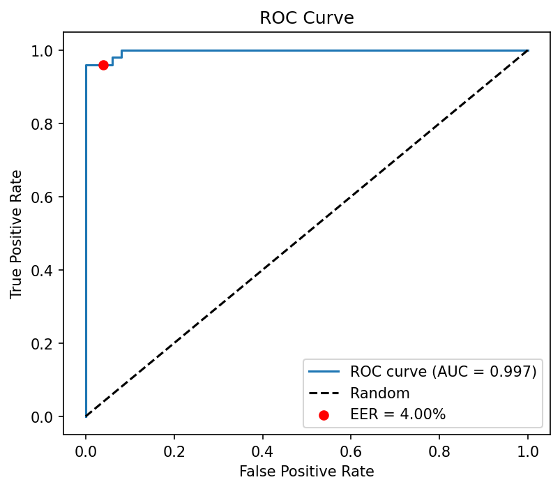
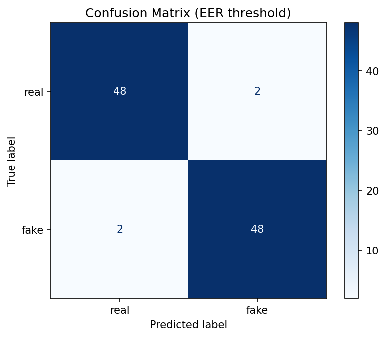
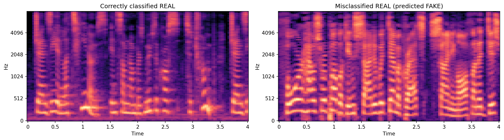

# VoiceShield AI — Deepfake Voice Detection

Detects whether a speech audio clip is **real (human)** or **AI-generated (synthetic/spoofed)** using a fine-tuned Wav2Vec2 model.

## Overview

AI voice cloning and TTS systems are increasingly used in scams (fake calls impersonating relatives, executives, etc.). This project builds and evaluates a binary classifier that distinguishes authentic human speech from AI-generated speech, using self-supervised audio representations.

## Approach

- **Model**: Pretrained `facebook/wav2vec2-base` (frozen) + lightweight classification head (Linear -> ReLU -> Dropout -> Linear)
- **Dataset**: [garystafford/deepfake-audio-detection](https://huggingface.co/datasets/garystafford/deepfake-audio-detection) - 1,866 balanced samples (real/fake); subset of 500 used for training/eval
- **Preprocessing**: resample to 16kHz, pad/truncate to 4-second fixed length
- **Training**: 5 epochs, AdamW, lr=1e-4, batch size 8 - only the 197K-parameter classification head is trained (Wav2Vec2 encoder frozen)

## Results

| Metric | Value |
|---|---|
| Test Accuracy (default threshold) | 86% |
| ROC-AUC | 0.997 |
| Equal Error Rate (EER) | 4.00% |
| Accuracy at EER threshold | 96% |

The high ROC-AUC relative to default-threshold accuracy revealed the model's decision boundary was miscalibrated - tuning the threshold to the EER point improved accuracy from 86% to 96% with balanced precision/recall across both classes.

## Error Analysis

All 14 misclassifications (at default threshold) were real samples predicted as fake, with prediction probabilities clustered near the decision boundary (0.52-0.83) - indicating genuine ambiguity rather than confident errors.

**Hypothesis**: Misclassified real samples show denser, more continuous spectral energy with fewer silence gaps compared to correctly-classified real samples. This may reflect the model associating "natural pauses/breathing" with bonafide speech - consistent with prior findings that TTS-generated speech typically lacks the leading/trailing silences present in human speech.

## Limitations & Future Work

- Trained on a 500-sample subset (250/250); full dataset (1,866 samples) and ASVspoof benchmark would test generalization
- Single architecture (Wav2Vec2); a CNN-on-spectrogram baseline would enable architecture comparison
- Future work: multi-feature fusion (pitch, prosody, spectral features), cross-dataset evaluation, multimodal (audio+video) deepfake detection

## Tech Stack

Python, PyTorch, Hugging Face Transformers (Wav2Vec2), librosa, scikit-learn, Google Colab
