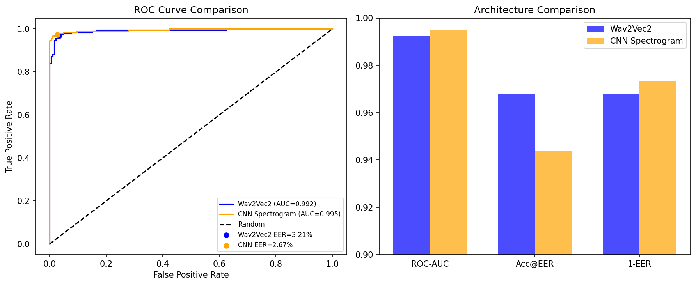

# VoiceShield AI — Explainable Deepfake Voice Detection


Detects whether a speech audio clip is **real (human)** or **AI-generated (synthetic/spoofed)** using two complementary architectures: a **Wav2Vec2 transformer** and a **CNN trained on Mel spectrograms**.

---

## Overview

Recent advances in text-to-speech (TTS) and voice cloning systems have made synthetic speech increasingly realistic, enabling new forms of fraud such as impersonation scams, fake customer-service calls, and executive voice spoofing.

VoiceShield AI investigates whether modern machine learning models can reliably distinguish authentic human speech from AI-generated audio. The project implements, compares, and evaluates two fundamentally different approaches:

* **Wav2Vec2 Transformer** — transfer learning using pretrained speech representations
* **CNN Spectrogram Classifier** — supervised learning on Mel spectrogram features

The goal is not only to maximize detection accuracy, but also to understand how different architectures capture artifacts of synthetic speech.

---

## Key Results

* Evaluated transformer-based and CNN-based approaches on **1,866 balanced audio samples**
* CNN classifier achieved **97.59% test accuracy**, **0.995 ROC-AUC**, and **2.67% Equal Error Rate (EER)**
* Wav2Vec2 achieved **0.992 ROC-AUC** and **96.79% accuracy at the optimal EER threshold**
* Comparative analysis showed that CNNs excel at spectro-temporal pattern recognition, while Wav2Vec2 benefits from pretrained speech representations and stronger calibration behavior

---

## Architecture Comparison

| Metric                            | Wav2Vec2   | CNN (Spectrogram) |
| --------------------------------- | ---------- | ----------------- |
| Test Accuracy (Default Threshold) | 85.03%     | **97.59%**        |
| ROC-AUC                           | 0.992      | **0.995**         |
| Equal Error Rate (EER)            | 3.21%      | **2.67%**         |
| Accuracy @ EER Threshold          | **96.79%** | 94.39%            |

### Interpretation

The CNN outperformed Wav2Vec2 on default-threshold accuracy and EER, suggesting that synthetic speech artifacts are strongly represented in spectrogram space.

However, Wav2Vec2 demonstrated better calibration at the optimal threshold, indicating that pretrained speech representations capture complementary information beyond handcrafted acoustic features.

Together, these findings suggest that future ensemble approaches may outperform either architecture individually.

---

## Results Visualization

| Architecture Comparison                                                 | ROC Curve                                   |
| ----------------------------------------------------------------------- | ------------------------------------------- |
|  |  |

### Confusion Matrix


---

## Dataset

Dataset: [garystafford/deepfake-audio-detection](https://huggingface.co/datasets/garystafford/deepfake-audio-detection)

### Statistics

* Total samples: **1,866**
* Real speech: **933**
* Synthetic speech: **933**
* Training samples: **1,492**
* Test samples: **374**
* Stratified 80/20 train-test split

### Preprocessing

* Resampled audio to **16 kHz**
* Padded/truncated clips to **4 seconds**
* Generated Mel spectrograms for CNN training
* Applied Wav2Vec2 feature extraction for transformer training

---

## Model Architectures

### Wav2Vec2 Transformer Classifier

**Backbone:** `facebook/wav2vec2-base`

* Frozen pretrained encoder (~94.5M parameters)
* Trainable classification head:

  * Linear(768 → 256)
  * ReLU
  * Dropout(0.3)
  * Linear(256 → 2)

**Trainable Parameters:** ~197K

**Training Configuration**

* Optimizer: AdamW
* Learning Rate: 1e-4
* Batch Size: 16
* Epochs: 4

---

### CNN Spectrogram Classifier

**Input:** 64-band Mel spectrogram (64 × 126)

Architecture:

* Conv Block 1: 32 filters
* Conv Block 2: 64 filters
* Conv Block 3: 128 filters
* Adaptive Average Pooling
* Fully Connected Classification Head

**Parameters:** ~618K

**Training Configuration**

* Optimizer: AdamW
* Learning Rate: 1e-3
* Batch Size: 32
* Epochs: 10

---

## Error Analysis

Misclassifications were concentrated in real samples predicted as synthetic, with probabilities near the decision boundary rather than highly confident failures.

This suggests genuine ambiguity in certain recordings rather than catastrophic model errors.


### Observations

Misclassified real samples frequently exhibited:

* Dense spectral energy
* Reduced silence intervals
* More continuous temporal structure

These characteristics resemble known properties of high-quality synthetic speech, which often lacks the natural pauses and variability present in human recordings.

---

## Repository Structure

```text
VoiceShield-AI/
├── README.md
├── notebook.ipynb
└── results/
    ├── eval_results.npz
    └── figures/
        ├── architecture_comparison.png
        ├── roc_curve.png
        ├── confusion_matrix.png
        └── error_analysis_spectrograms.png
```

---

## Reproducing Results

### 1. Install Dependencies

```bash
pip install torch transformers datasets librosa scikit-learn matplotlib numpy
```

### 2. Open the Notebook

```text
notebook.ipynb
```

### 3. Run All Cells

The notebook will:

* Download the dataset from Hugging Face
* Perform preprocessing
* Train the Wav2Vec2 classifier
* Train the CNN baseline
* Evaluate both models
* Generate all figures and metrics

---

## Limitations

* Evaluated on a single deepfake-audio dataset
* Cross-dataset generalization was not assessed
* Model robustness to unseen synthesis systems remains unknown
* No real-time deployment pipeline was implemented

---

## Future Work

* Evaluation on ASVspoof benchmarks
* Ensemble fusion of CNN and Wav2Vec2 predictions
* Prosody and pitch-based feature engineering
* Explainability methods (Grad-CAM, saliency maps)
* Real-time inference pipeline
* Multimodal deepfake detection (audio + video)

---

## Tech Stack

* Python
* PyTorch
* Hugging Face Transformers
* Wav2Vec2
* librosa
* scikit-learn
* NumPy
* Matplotlib
* Google Colab

---

## Author

Developed as an applied machine learning project investigating deepfake voice detection, model comparison, and explainable evaluation of synthetic speech classifiers.
